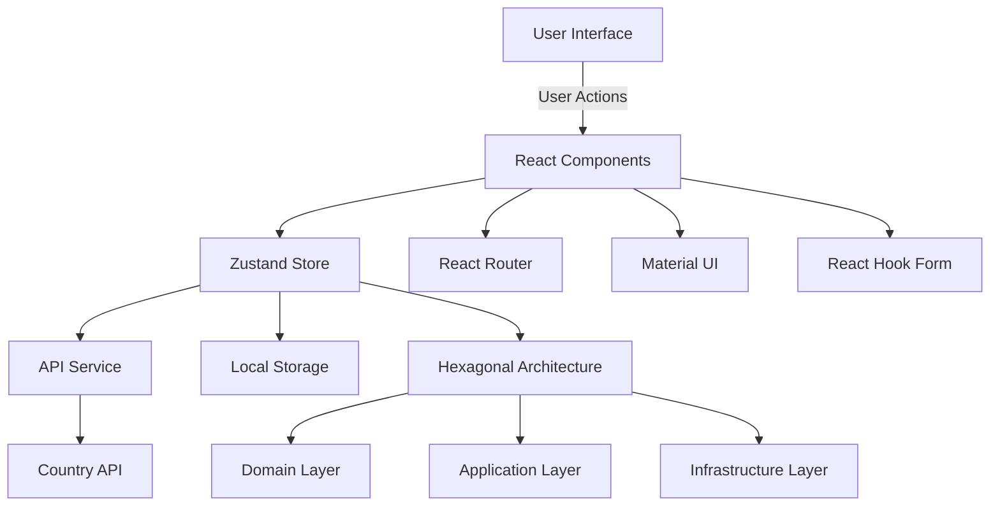

# EcoFruit Store - Frontend Technical Test

This project is an e-commerce application developed as part of the Technical Test for the Senior Frontend Developer position. The application allows users to browse a catalog of products (fruits), add them to the cart, make purchases, and generate invoices. Additionally, it has an administration panel to view all completed purchases.

## Technologies Used

- React 19 with TypeScript
- Vite as bundler
- Zustand for global state management
- Material UI for interface components
- React Router v7 for navigation
- React Hook Form for form management
- Jest and React Testing Library for testing
- Storybook for component documentation
- Turborepo for monorepo management
- Lefthook for git hooks
- Tailwind CSS for general styles
- ESLint and TypeScript for code quality

## Deployment

The application is deployed on AWS S3 web site and can be accessed at:

- Live Demo: <http://front-end-challenge.s3-website-us-east-1.amazonaws.com/>

## Installation and Execution

### Prerequisites

- Node.js 20 or higher
- npm 9 or higher

### Installation

```bash
# Clone the repository
git clone https://github.com/dalejandrorincon/front-end-challenge.git

# Install dependencies
npm install

# Run in development mode
npm run dev

# Build the project
npm run build:app

# Run tests
npm run test

# Run linting
npm run lint

# Run Storybook
cd packages/ui-library
npm run storybook
```

## Main Features

### Client

- 📌 **Navigation** through the product catalog (fruits).
- 🔍 **Filtering** by categories.
- 🛍 **Add/remove** products from the cart.
- 🧾 **Invoice generation** stored in `localStorage`.

### Administrator

- 🔑 **Access to the administration panel** (user with "admin" in the email).
- 📂 **View generated invoices**.
- 📄 **Complete details** of each purchase.
- 🖨 **Option to print** invoices.

## 🛠 Technical Decisions

### 🚀 Monorepo with Turborepo

I used **Turborepo** to structure the project as a monorepo, facilitating component reuse, centralizing configurations, and efficiently managing dependencies.

### 🔄 State Management with Zustand

I used **Zustand** for its simple and efficient API. It allows managing global state without unnecessary dependencies and supports persistence with **persist** to retain data between sessions.

### 🎨 UI Library

A **component library** was developed to:

- 📌 **Centralize reusable components**.
- 🚀 **Allow independent evolution** of components.
- 📖 **Documentation with Storybook**.
- 🎨 **Visual consistency** throughout the application.

## 📋 Installation

To get started with the project, follow these steps:

1. **Clone the repository**:

   ```sh
   git clone https://github.com/dalejandrorincon/front-end-challenge.git
   cd front-end-challenge
   ```

2. **Install dependencies**:

   ```sh
   npm install
   ```

## 🚀 Running the Application

To run the application locally, use the following command:

```sh
npm run dev
```

## 🧪 Testing

To run tests, use the following command:

```sh
npm run test
```

## 📊 Design Patterns and Architecture

The project follows several design patterns to ensure a clean and maintainable codebase. Below is a diagram illustrating the main architectural components and their interactions:

### Hexagonal Architecture

Hexagonal architecture, also known as ports and adapters, is applied to decouple the core logic from external systems. This approach provides several benefits:

- **Modularity**: Each layer (Domain, Application, Infrastructure) is independent, making the codebase easier to maintain and extend.
- **Testability**: Core logic can be tested in isolation without dependencies on external systems.
- **Flexibility**: Adapters can be swapped without affecting the core logic, allowing for easy integration with different technologies.

### Architectural Components



### Explanation

- **User Interface**: The entry point where users interact with the application.
- **React Components**: The building blocks of the UI, handling user interactions and rendering.
- **Zustand Store**: Manages the global state of the application, ensuring data consistency.
- **API Service**: Handles communication with external APIs, such as the Country API.
- **Country API**: Provides additional data used within the application.
- **Local Storage**: Persists data locally to maintain state between sessions.
- **React Router**: Manages navigation within the application.
- **Material UI**: Provides pre-built UI components for a consistent look and feel.
- **React Hook Form**: Manages form state and validation.

This architecture ensures a modular and scalable application, with clear separation of concerns and efficient state management.

Automated **tests** were implemented with Jest and React Testing Library:

- ✅ **Component tests in isolation**.
- 🔄 **Mocking dependencies** (hooks, store).
- 🖱 **Validation of user interactions**.

## Repository and Deployment

- **Live Demo**: <http://front-end-challenge.s3-website-us-east-1.amazonaws.com/>

## State Management and API Consumption

### Zustand

Zustand was chosen for its simplicity and efficiency in managing global state. It allows for easy state persistence and minimal boilerplate code.

### API Consumption

The application consumes a country API to provide additional functionalities. The API integration is handled with proper error handling and state management using Zustand.

## Automated Tests

Three key tests were implemented and documented:

1. **Component Rendering**: Ensures components render correctly with mock data.
2. **User Interaction**: Validates user interactions such as adding/removing items from the cart.
3. **State Management**: Tests the state persistence and updates using Zustand.

## Code Quality and Structure

The code follows best practices with a clean and organized structure. ESLint and TypeScript are used to maintain code quality, and design patterns are justified and documented within the codebase.
